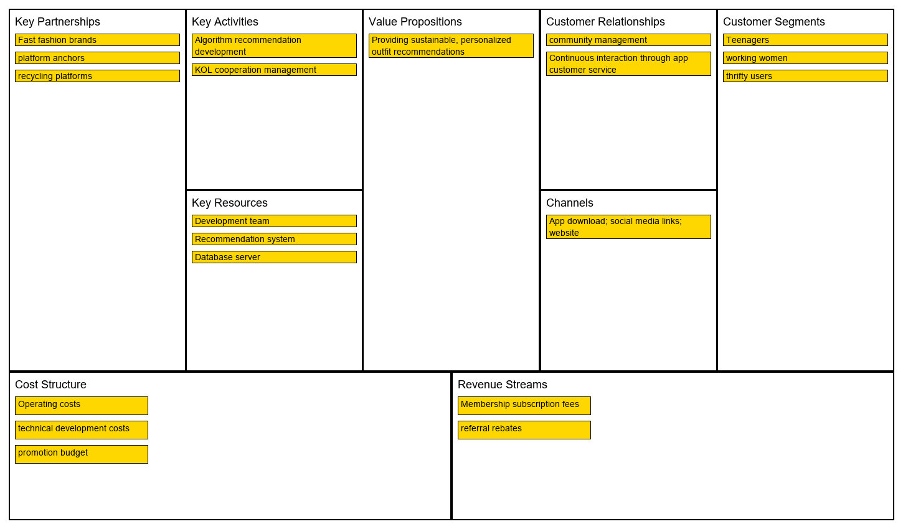
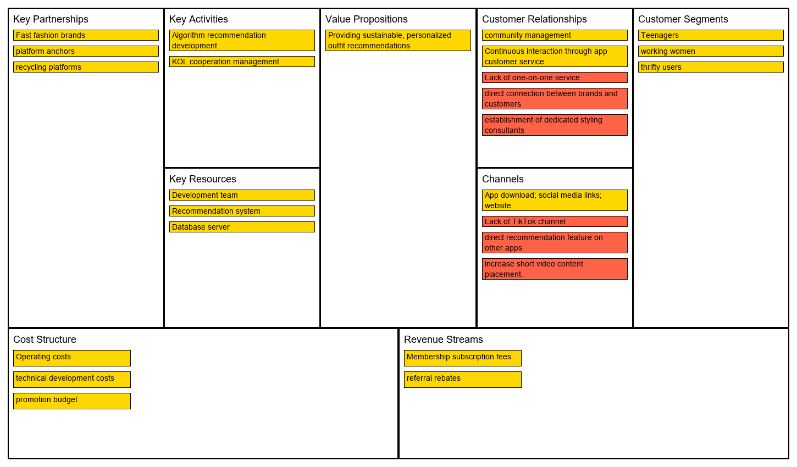
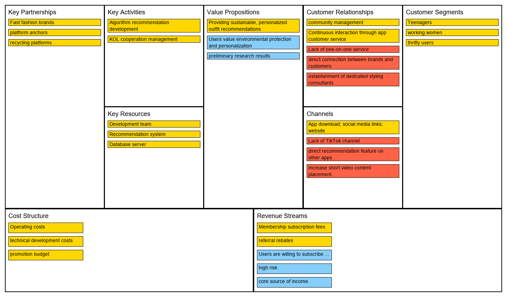

# 🧩 BMC Generator

A tool to generate Business Model Canvas (BMC) diagrams directly from an Excel file.  
✅ Designed for **University of Ottawa’s GNG4120 / GNG5120** GA2.

## ✨ Features

- Auto-layout of BMC blocks using fixed proportions
- Reads structured Excel input (no drag-and-drop required)
- Color-coded boxes based on classification:
  - 🟡 **Baseline**
  - 🔴 **Health Check**
  - 🔵 **Assumptions**
- Supports vertical layout (top blocks) and column-based wrapping (bottom blocks)

---

## 🧾 Excel Input Format

| Block               | Content                             | Class           |
|---------------------|--------------------------------------|-----------------|
| Value Propositions   | Providing sustainable recommendations | Baseline        |
| Customer Relationships | Lack of one-on-one service          | Health Check    |
| Revenue Streams      | high risk                            | Assumptions     |

- **Block**: One of 9 BMC categories (e.g. Key Activities, Channels, etc.)
- **Content**: Text to display inside the box
- **Class**: One of `Baseline`, `Health Check`, or `Assumptions`

---

## 🖼 Output Examples

### ✅ 1. Baseline only


---

### ✅ 2. Baseline + Health Check


---

### ✅ 3. Baseline + Health Check + Assumptions


---

## 🛠 Installation

```bash
pip install pandas pillow openpyxl
